<!-- ═══════════════════════════════════════════════════════════ -->
<!--   NICONVE™  ·  Alden Prabaswara  ·  GitHub Profile         -->
<!--   Auto dark ↔ light  ·  Private repo stats included  ✦     -->
<!-- ═══════════════════════════════════════════════════════════ -->

<div align="center">

<!-- ════ ANIMATED BANNER — auto switches dark/light ════ -->
<picture>
  <source media="(prefers-color-scheme: dark)"  srcset="./banner-dark.svg"/>
  <source media="(prefers-color-scheme: light)" srcset="./banner-light.svg"/>
  
</picture>

</div>

&nbsp;

<!-- ════ BIO + PHOTO ════ -->
<table width="100%"><tr>
<td valign="top" width="68%">

<picture>
  <source media="(prefers-color-scheme: dark)"
    srcset="https://readme-typing-svg.demolab.com?font=DM+Serif+Display&weight=400&size=24&pause=1400&color=F4F3EF&vCenter=true&width=520&lines=Where+different+is+the+standard.+✦;Code+is+poetry+in+motion.;Build+things+that+matter.;Creative+Developer+·+Designer+·+Creator"/>
  <source media="(prefers-color-scheme: light)"
    srcset="https://readme-typing-svg.demolab.com?font=DM+Serif+Display&weight=400&size=24&pause=1400&color=0A0A0A&vCenter=true&width=520&lines=Where+different+is+the+standard.+✦;Code+is+poetry+in+motion.;Build+things+that+matter.;Creative+Developer+·+Designer+·+Creator"/>
  
</picture>

<br/><br/>

```yaml
brand   : NICONVE™
name    : Alden Prabaswara
campus  : Teknik Informatika · Universitas Brawijaya
city    : Malang, Jawa Timur · Indonesia
stack   : Android Dev · Next.js · Kotlin · Java
status  : ● Open — available for collab & freelance
```

</td>
<td valign="top" align="center" width="32%">

<!--
  ════════════════════════════════
  🖼️  SLOT FOTO — rename fotomu
      jadi:  photo.png
      lalu upload ke repo ini
  ════════════════════════════════
-->
<picture>
  <source media="(prefers-color-scheme: dark)"
    srcset="./photo.png"/>
  <source media="(prefers-color-scheme: light)"
    srcset="./photo.png"/>
  
</picture>
<br/>
<sub><code>← upload photo.png</code></sub>

</td>
</tr></table>

<!-- ════ RED LINE DIVIDER ════ -->
<picture>
  <source media="(prefers-color-scheme: dark)"  srcset="https://capsule-render.vercel.app/api?type=rect&color=e8290b&height=2&section=header"/>
  <source media="(prefers-color-scheme: light)" srcset="https://capsule-render.vercel.app/api?type=rect&color=e8290b&height=2&section=header"/>
  
</picture>

&nbsp;

<!-- ════ STATS — includes private repos ════ -->
## 📊 Stats

> Stats di bawah menghitung **semua repo termasuk yang privat** karena menggunakan token dengan scope `read:user` dan `repo`.

<div align="center">

<!-- Total commits + private repos + stars etc -->
<picture>
  <source media="(prefers-color-scheme: dark)"
    srcset="https://github-readme-stats.vercel.app/api?username=Niconve&show_icons=true&hide_border=true&bg_color=0a0a0a&title_color=f4f3ef&text_color=8a8a8a&icon_color=e8290b&include_all_commits=true&count_private=true&show=reviews,discussions_started,prs_merged,prs_merged_percentage"/>
  <source media="(prefers-color-scheme: light)"
    srcset="https://github-readme-stats.vercel.app/api?username=Niconve&show_icons=true&hide_border=true&bg_color=f4f3ef&title_color=0a0a0a&text_color=555&icon_color=e8290b&include_all_commits=true&count_private=true&show=reviews,discussions_started,prs_merged,prs_merged_percentage"/>
  
</picture>
<picture>
  <source media="(prefers-color-scheme: dark)"
    srcset="https://github-readme-stats.vercel.app/api/top-langs/?username=Niconve&layout=compact&hide_border=true&bg_color=0a0a0a&title_color=f4f3ef&text_color=8a8a8a&langs_count=8&count_private=true"/>
  <source media="(prefers-color-scheme: light)"
    srcset="https://github-readme-stats.vercel.app/api/top-langs/?username=Niconve&layout=compact&hide_border=true&bg_color=f4f3ef&title_color=0a0a0a&text_color=555&langs_count=8&count_private=true"/>
  
</picture>

<br/>

<!-- Streak — consistent commits + private -->
<picture>
  <source media="(prefers-color-scheme: dark)"
    srcset="https://github-readme-streak-stats.herokuapp.com/?user=Niconve&hide_border=true&background=0a0a0a&ring=e8290b&fire=e8290b&currStreakLabel=f4f3ef&sideLabels=8a8a8a&dates=444&currStreakNum=f4f3ef&sideNums=f4f3ef&stroke=0a0a0a&mode=weekly"/>
  <source media="(prefers-color-scheme: light)"
    srcset="https://github-readme-streak-stats.herokuapp.com/?user=Niconve&hide_border=true&background=f4f3ef&ring=e8290b&fire=e8290b&currStreakLabel=0a0a0a&sideLabels=888&dates=aaa&currStreakNum=0a0a0a&sideNums=0a0a0a&stroke=f4f3ef&mode=weekly"/>
  
</picture>

<br/>

<!-- WakaTime / detailed stats — private included -->
<picture>
  <source media="(prefers-color-scheme: dark)"
    srcset="https://github-profile-summary-cards.vercel.app/api/cards/profile-details?username=Niconve&theme=github_dark"/>
  <source media="(prefers-color-scheme: light)"
    srcset="https://github-profile-summary-cards.vercel.app/api/cards/profile-details?username=Niconve&theme=github"/>
  
</picture>

<br/>

<!-- Repo + commit split cards -->
<picture>
  <source media="(prefers-color-scheme: dark)"
    srcset="https://github-profile-summary-cards.vercel.app/api/cards/repos-per-language?username=Niconve&theme=github_dark"/>
  <source media="(prefers-color-scheme: light)"
    srcset="https://github-profile-summary-cards.vercel.app/api/cards/repos-per-language?username=Niconve&theme=github"/>
  
</picture>
<picture>
  <source media="(prefers-color-scheme: dark)"
    srcset="https://github-profile-summary-cards.vercel.app/api/cards/most-commit-language?username=Niconve&theme=github_dark"/>
  <source media="(prefers-color-scheme: light)"
    srcset="https://github-profile-summary-cards.vercel.app/api/cards/most-commit-language?username=Niconve&theme=github"/>
  
</picture>
<picture>
  <source media="(prefers-color-scheme: dark)"
    srcset="https://github-profile-summary-cards.vercel.app/api/cards/stats?username=Niconve&theme=github_dark"/>
  <source media="(prefers-color-scheme: light)"
    srcset="https://github-profile-summary-cards.vercel.app/api/cards/stats?username=Niconve&theme=github"/>
  
</picture>

</div>

> ⚡ **Agar repo privat terhitung:** Pergi ke [github-readme-stats vercel deploy](https://github.com/anuraghazra/github-readme-stats#deploy-on-your-own) → deploy sendiri → tambahkan `PAT_1` token dengan scope `repo` → pakai URL deploy kamu sendiri di atas.

&nbsp;

<!-- ════ TROPHIES ════ -->
## 🏆 Trophies

<div align="center">
<picture>
  <source media="(prefers-color-scheme: dark)"
    srcset="https://github-profile-trophy.vercel.app/?username=Niconve&theme=onestar&no-frame=true&no-bg=true&margin-w=6&column=7"/>
  <source media="(prefers-color-scheme: light)"
    srcset="https://github-profile-trophy.vercel.app/?username=Niconve&theme=flat&no-frame=true&no-bg=false&margin-w=6&column=7"/>
  
</picture>
</div>

&nbsp;

<!-- ════ STACK ════ -->
## ⚙️ Stack

<div align="center">

<picture>
  <source media="(prefers-color-scheme: dark)"  srcset="https://skillicons.dev/icons?i=androidstudio,kotlin,java,nextjs&theme=dark"/>
  <source media="(prefers-color-scheme: light)" srcset="https://skillicons.dev/icons?i=androidstudio,kotlin,java,nextjs&theme=light"/>
  
</picture>

</div>

&nbsp;

<!-- ════ SHOWCASE ════ -->
## 🖼️ Showcase

<!--
  ════════════════════════════════════════════════════
  🖼️  SLOT GAMBAR PROJECT
  Cara paling mudah upload gambar:
  1. Buka tab Issues di repo ini
  2. Klik New Issue
  3. Drag & drop screenshot kamu ke text area
  4. GitHub langsung kasih URL → copy
  5. Cancel issue (tidak perlu submit)
  6. Paste URL ke src="" di bawah

  Nama file untuk kamu rename sebelum upload:
  → project1.png  project2.png  project3.png  project4.png
  ════════════════════════════════════════════════════
-->

<div align="center"><table><tr>
<td align="center" width="50%">

<br/><sub><b>Project Name</b> &nbsp;·&nbsp; Next.js · Web App</sub>
</td>
<td align="center" width="50%">

<br/><sub><b>App Name</b> &nbsp;·&nbsp; React Native · Android APK</sub>
</td>
</tr><tr>
<td align="center" width="50%">

<br/><sub><b>Design Work</b> &nbsp;·&nbsp; Figma · UI/UX</sub>
</td>
<td align="center" width="50%">

<br/><sub><b>Coming Soon</b> &nbsp;·&nbsp; ✦ stay tuned</sub>
</td>
</tr></table></div>

&nbsp;

<!-- ════ ACTIVITY ════ -->
## 📈 Activity

<div align="center">
<picture>
  <source media="(prefers-color-scheme: dark)"
    srcset="https://github-readme-activity-graph.vercel.app/graph?username=Niconve&theme=react-dark&hide_border=true&bg_color=0a0a0a&color=8a8a8a&line=e8290b&point=f4f3ef&area=true&area_color=e8290b"/>
  <source media="(prefers-color-scheme: light)"
    srcset="https://github-readme-activity-graph.vercel.app/graph?username=Niconve&theme=github&hide_border=true&bg_color=f4f3ef&color=555&line=e8290b&point=0a0a0a&area=true&area_color=e8290b"/>
  
</picture>
</div>

&nbsp;

<!-- ════ COMMUNITY ════ -->
## 🏛️ Community

<div align="center">


&nbsp;

&nbsp;

&nbsp;


</div>

&nbsp;

<!-- ════ CONNECT ════ -->
## 🌐 Connect

<div align="center">

[](https://instagram.com/niconve)
&nbsp;
[](https://linkedin.com/in/niconve)
&nbsp;
[](https://github.com/Niconve)
&nbsp;
[](mailto:alden@niconve.dev)
&nbsp;
[](https://niconve.dev)

<br/>


&nbsp;


</div>

&nbsp;

<!-- ════ FOOTER ════ -->
<picture>
  <source media="(prefers-color-scheme: dark)"  srcset="https://capsule-render.vercel.app/api?type=rect&color=0a0a0a&height=64&text=%22Kode%20adalah%20seni.%20Setiap%20baris%20adalah%20karya%20yang%20berbicara.%22&fontSize=15&fontColor=444&fontStyle=italic&animation=fadeIn"/>
  <source media="(prefers-color-scheme: light)" srcset="https://capsule-render.vercel.app/api?type=rect&color=eceae4&height=64&text=%22Kode%20adalah%20seni.%20Setiap%20baris%20adalah%20karya%20yang%20berbicara.%22&fontSize=15&fontColor=bbb&fontStyle=italic&animation=fadeIn"/>
  
</picture>

<div align="center">
<sub><code>NICONVE™ · Alden Prabaswara · © 2026 · Malang, ID · ✦ e8290b</code></sub>
</div>
