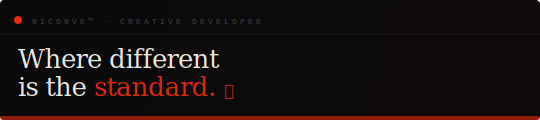
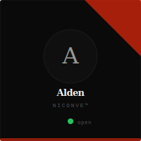
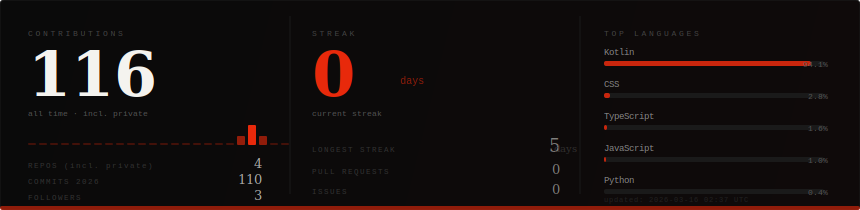
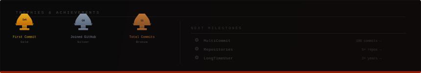
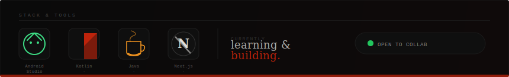
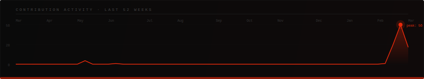

<!-- NICONVE™ · Alden Prabaswara · GitHub Profile README -->

<div align="center">
<picture>
  <source media="(prefers-color-scheme: dark)"  srcset="./banner-dark.svg"/>
  <source media="(prefers-color-scheme: light)" srcset="./banner-light.svg"/>
  
</picture>
</div>

&nbsp;

<table width="100%"><tr>
<td valign="top" width="65%">



<br/><br/>

```yaml
brand   : NICONVE™
name    : Alden Prabaswara
campus  : Teknik Informatika · Universitas Brawijaya
city    : Malang, Jawa Timur · Indonesia
stack   : Android Dev · Next.js · Kotlin · Java
status  : ● Open — available for collab & freelance
```

</td>
<td valign="top" align="center" width="35%">



</td>
</tr></table>


&nbsp;

## 📊 Stats

<div align="center">

</div>

&nbsp;

## 🏆 Trophies

<div align="center">

</div>

&nbsp;

## ⚙️ Stack

<div align="center">

</div>

&nbsp;

## ✦ Showcase

<div align="center"><table><tr>
<td align="center" width="50%">

<br/><sub><b>Android Dev</b> · Kotlin · Java · Android Studio</sub>
</td>
<td align="center" width="50%">

<br/><sub><b>Web Dev</b> · Next.js · React</sub>
</td>
</tr><tr>
<td align="center" width="50%">

<br/><sub><b>Mobile</b> · Kotlin · JVM · OOP</sub>
</td>
<td align="center" width="50%">

<br/><sub><b>NICONVE™</b> · Creative Developer · Malang</sub>
</td>
</tr></table></div>

&nbsp;

## 📈 Activity

<div align="center">

</div>

&nbsp;

## 🏛️ Community

<div align="center">


&nbsp;

&nbsp;

&nbsp;


</div>

&nbsp;

## 🌐 Connect

<div align="center">

[](https://instagram.com/niconve)
&nbsp;
[](https://linkedin.com/in/niconve)
&nbsp;
[](https://github.com/Niconve)
&nbsp;
[](mailto:alden@niconve.dev)
&nbsp;
[](https://niconve.dev)

<br/>


</div>

&nbsp;

<div align="center">

```
  ──────────────────────────────────────────────────────────────
    NICONVE™  ·  Alden Prabaswara  ·  © 2026  ·  Malang  ·  ID
    "Kode adalah seni. Setiap baris adalah karya yang berbicara."
  ──────────────────────────────────────────────────────────────
```

</div>
