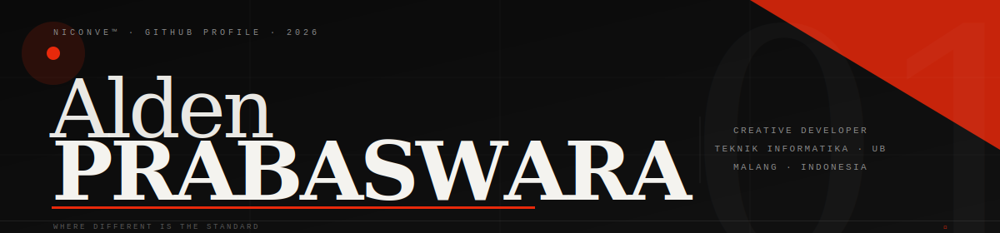

<!-- ══════════════════════════════════════════════════════════════ -->
<!--   NICONVE™  ·  Alden Prabaswara  ·  GitHub Profile README    -->
<!-- ══════════════════════════════════════════════════════════════ -->

<div align="center">

<!--
  ┌─────────────────────────────────────────────────────────────┐
  │  🖼️  BANNER — Upload file banner.svg / banner.png ke repo   │
  │  ini, lalu uncomment baris  di bawah dan hapus yang    │
  │  capsule-render. Atau langsung pakai capsule-render dulu.   │
  └─────────────────────────────────────────────────────────────┘

  OPSI A — Pakai banner custom (setelah upload banner.svg):
  

  OPSI B — Capsule render sementara (aktif sekarang):
-->


</div>

<!---------------------------------------------------------------------------->

<table width="100%"><tr><td>

```
  ✦  NICONVE™                        ◆  Alden Prabaswara
  ─────────────────────────────────────────────────────
  Campus  →  Teknik Informatika · Universitas Brawijaya
  City    →  Malang, Jawa Timur · Indonesia
  Stack   →  Full Stack · UI/UX · AI/ML · Mobile
  Status  →  ● Open — available for collab & freelance
  Quote   →  "Where different is the standard."
```

</td><td width="35%" align="right">

<!--
  ┌────────────────────────────────────┐
  │  🖼️  SLOT FOTO / AVATAR KAMU      │
  │  Ganti URL # dengan link foto kamu │
  └────────────────────────────────────┘
-->


<!-- Setelah upload foto:

-->

</td></tr></table>

<!---------------------------------------------------------------------------->
<!--- DIVIDER -->


&nbsp;

## &nbsp;⚙&nbsp; Stack

<div align="center">

| Frontend | Backend | Design & Mobile | AI & Infra |
|:---:|:---:|:---:|:---:|
|     |     |     |     |

</div>

&nbsp;

<!---------------------------------------------------------------------------->

## &nbsp;📊&nbsp; Stats

<div align="center">

<a href="https://github.com/Niconve">
  
</a>
<a href="https://github.com/Niconve">
  
</a>

<br/>

<a href="https://git.io/streak-stats">
  
</a>

</div>

&nbsp;

<!---------------------------------------------------------------------------->

## &nbsp;🖼️&nbsp; Showcase

<!--
  ┌─────────────────────────────────────────────────────────────────┐
  │  CARA ISI GAMBAR PROJECT:                                       │
  │  1. Buka tab Issues repo ini                                    │
  │  2. Klik New Issue → drag & drop screenshot → cancel issue      │
  │  3. GitHub kasih URL gambar → copy paste ke src di bawah       │
  └─────────────────────────────────────────────────────────────────┘
-->

<div align="center">

<table>
<tr>
<td align="center" width="380">

<!-- 🖼️ SLOT PROJECT 1 — ganti URL -->

<br/><sub><b>Project Name</b> · Next.js · Web App</sub>

</td>
<td align="center" width="380">

<!-- 🖼️ SLOT PROJECT 2 — ganti URL -->

<br/><sub><b>App Name</b> · React Native · Android APK</sub>

</td>
</tr>
<tr>
<td align="center" width="380">

<!-- 🖼️ SLOT PROJECT 3 — ganti URL -->

<br/><sub><b>Design Work</b> · Figma · UI/UX</sub>

</td>
<td align="center" width="380">

<!-- 🖼️ SLOT PROJECT 4 — ganti URL -->

<br/><sub><b>Next Project</b> · Stay tuned ✦</sub>

</td>
</tr>
</table>

</div>

&nbsp;

<!---------------------------------------------------------------------------->

## &nbsp;🏛️&nbsp; Community & Activity

<div align="center">


&nbsp;

&nbsp;

&nbsp;


<br/><br/>

[](https://github.com/ashutosh00710/github-readme-activity-graph)

</div>

&nbsp;

<!---------------------------------------------------------------------------->

<!---------------------------------------------------------------------------->

&nbsp;

## &nbsp;🌐&nbsp; Connect

<div align="center">

[](https://instagram.com/niconve)
&nbsp;
[](https://linkedin.com/in/niconve)
&nbsp;
[](https://github.com/Niconve)
&nbsp;
[](mailto:alden@niconve.dev)
&nbsp;
[](https://niconve.dev)

<br/><br/>


&nbsp;&nbsp;


</div>

<!---------------------------------------------------------------------------->

<div align="center">
<br/>

```
  ──────────────────────────────────────────────────────────
    NICONVE™  ·  Alden Prabaswara  ·  © 2026  ·  Malang ID
    Where different is the standard.           ✦ e8290b
  ──────────────────────────────────────────────────────────
```

</div>
